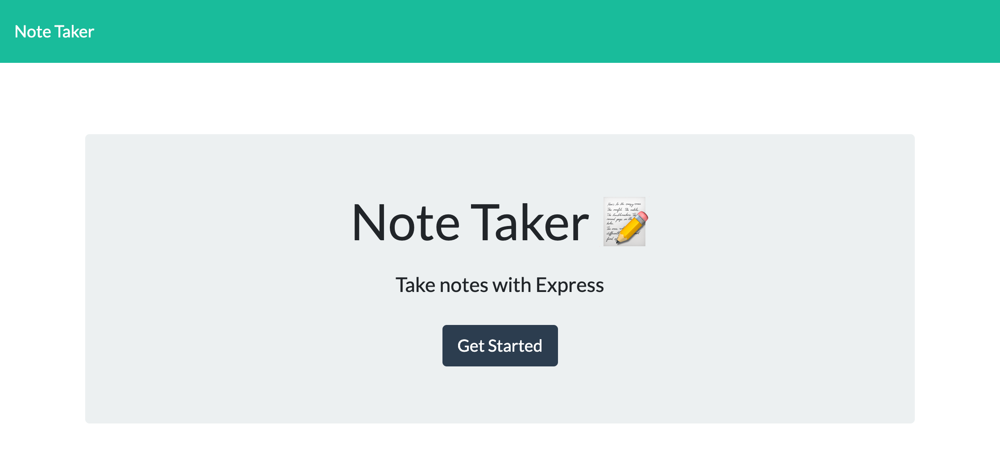
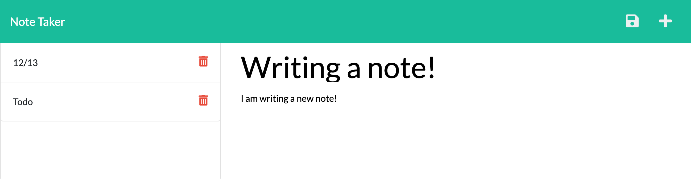

# note-taker

## Description

A great note taking app you can use to keep track of anything you want. Create new notes, view notes, and delete notes. This application will also save your notes if you leave your browser!

## Installation

No installation is necessary for this application! Visit it at the live link below.

## Usage

[Github Repo](https://github.com/hope428/note-taker) 
[Deployed App](https://hidden-citadel-87475.herokuapp.com/)🚀

## Credits
Penn University Bootcamp for the front end code.  
Backend code by me

## Features
- Create new notes
- View old notes
- Delete notes